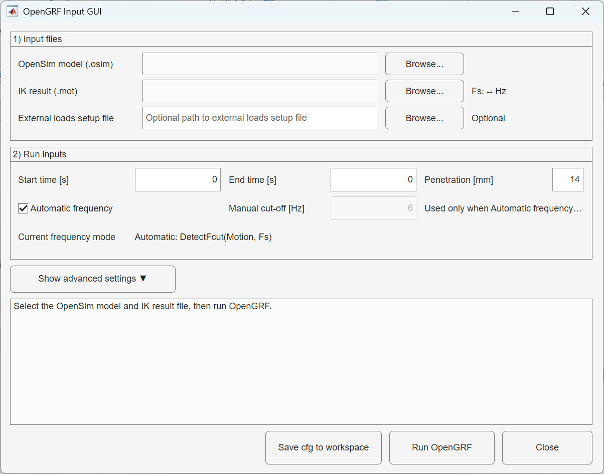

# OpenGRF

OpenGRF is a MATLAB/OpenSim API tool for predicting Ground Reaction Forces (GRFs) from a subject-specific musculoskeletal model and inverse-kinematics motion data.

The workflow is designed to be run from MATLAB, either through the provided graphical user interface or programmatically through a configuration structure.

## Authors and contacts

Authors:

- Andrea Di Pietro
- Francesca Di Puccio
- Luca Modenese

Affiliations:

- Department of Civil and Industrial Engineering, University of Pisa, Italy
- School of Biomedical Engineering, UNSW, Australia

Contacts:

- andrea.dipietro@phd.unipi.it
- andrea.dipietro94@gmail.com

## Requirements

Before running OpenGRF, make sure you have:

- MATLAB installed.
- OpenSim installed with the MATLAB scripting/API environment correctly configured.
- The OpenSim Java API available from MATLAB through `org.opensim.modeling.*`.
- The OpenGRF MATLAB files in the same folder, or otherwise available on the MATLAB path.
- A scaled or subject-specific OpenSim musculoskeletal model in `.osim` format.
- An inverse-kinematics motion file in `.mot` format.

For the automatic cut-off frequency option, the code uses continuous wavelet transform through MATLAB's `cwt` function. Make sure the required MATLAB toolbox is available in your installation.

## Important file-name note

MATLAB function files should be named exactly as their main function.

Recommended file names:

```text
OpenGRF_GUI.m
run_OpenGRF_from_config.m
BKanalysis.m
DetectFcut.m
ExecuteFR.m
ExecutePK.m
UpdateSphereLocs.m
fuseCOP.m
load_mot.m
load_sto.m
load_trc.m
storageToMat.m
```

## Repository contents

| File | Purpose |
| --- | --- |
| `OpenGRF_GUI.m` | Single-window GUI for selecting input files, setting analysis parameters, saving a configuration, and running OpenGRF. |
| `run_OpenGRF_from_config.m` | Main execution function. Runs the OpenGRF workflow from a `cfg` structure or from `OpenGRF_GUI_config` in the MATLAB workspace. |
| `BKanalysis.m` | Runs OpenSim Body Kinematics and extracts body positions, velocities, accelerations, centre of mass, and contact-related body data. |
| `DetectFcut.m` | Estimates a suitable low-pass cut-off frequency from the kinematics using a continuous-wavelet-transform approach. |
| `ExecutePK.m` | Runs Point Kinematics for contact probes/spheres. |
| `ExecuteFR.m` | Runs Force Reporter to detect contact forces between probes and contact planes. |
| `UpdateSphereLocs.m` | Updates calibrated contact-sphere locations in the OpenSim model. |
| `fuseCOP.m` | Fuses geometry-based and dynamics-based Centre of Pressure trajectories during single stance. |
| `load_mot.m`, `load_sto.m`, `load_trc.m` | Utility functions for loading OpenSim motion, storage, and marker files. |
| `storageToMat.m` | Converts an OpenSim `Storage` object to MATLAB arrays. |

## MATLAB setup

1. Configure the OpenSim API environment variables for MATLAB by following the OpenSim MATLAB scripting documentation.
2. Restart MATLAB after setting the environment variables.
3. Create a working folder for OpenGRF.
4. Place all OpenGRF `.m` files in that folder.
5. Open the folder in MATLAB or add it to the MATLAB path:

```matlab
addpath('path/to/OpenGRF')
```

## Quick start with the GUI

From the OpenGRF folder, run:

```matlab
OpenGRF_GUI
```

Then use the GUI to:

1. Select the OpenSim model file (`.osim`).
2. Select the inverse-kinematics motion file (`.mot`).
3. Optionally select an external loads setup file.
4. Set the analysis start and end time.
5. Choose the kinematics low-pass filtering mode:
   - **Automatic frequency**: uses `DetectFcut(Motion, Fs)`.
   - **Manual cut-off**: uses the manually entered frequency in Hz.
6. Set the maximum contact penetration in millimetres. The default value is `14 mm`.
7. Use **Advanced settings** if you need to edit:
   - contact body names,
   - contact plane positions,
   - contact plane orientation.
8. Click **Run OpenGRF**.

The GUI saves the input configuration to the MATLAB workspace as:

```matlab
OpenGRF_GUI_config
```

After a successful run, the output structure is saved as:

```matlab
OpenGRF_GUI_output
```

## Programmatic usage

You can also run OpenGRF directly from a MATLAB structure:

```matlab
cfg = struct();

% Required input files
cfg.ModelPath = 'path/to/scaled_model.osim';
cfg.IKPath = 'path/to/inverse_kinematics.mot';

% Optional external loads setup file. Leave empty if not used.
cfg.ExternalForceSetupPath = '';

% Analysis time range [s]
cfg.TimeStart = 0.0;
cfg.TimeEnd = 1.0;

% Maximum contact penetration [mm]
cfg.PenetrationMM = 14;

% Contact body names. Edit these if your model uses different body names.
cfg.ContactBodies = struct();
cfg.ContactBodies.CalcnRight = 'calcn_r';
cfg.ContactBodies.CalcnLeft  = 'calcn_l';
cfg.ContactBodies.ToesRight  = 'toes_r';
cfg.ContactBodies.ToesLeft   = 'toes_l';
cfg.ContactBodies.HandRight  = 'hand_r';
cfg.ContactBodies.HandLeft   = 'hand_l';

% Contact plane locations [X Y Z].
% For level-ground tasks, these can usually remain at zero.
% For stairs or different-height surfaces, set planes A and B accordingly.
cfg.Ground_R_Foot_T_A = [0 0 0];
cfg.Ground_R_Foot_T_B = [0 0 0];
cfg.Ground_L_Foot_T_A = [0 0 0];
cfg.Ground_L_Foot_T_B = [0 0 0];
cfg.Ground_R_Hand_T   = [0 0 0];
cfg.Ground_L_Hand_T   = [0 0 0];

% Contact plane orientation [rad]
cfg.x_angle = 0;
cfg.z_angle = -pi/2;

% Filtering settings
cfg.AutoFreq = true;
cfg.Freq = 6;  % Used only when cfg.AutoFreq is false

out = run_OpenGRF_from_config(cfg);
```

The returned `out` structure contains:

```matlab
out.SolutionFolder
out.PredictedGRFFile
out.ModelProcessedPath
out.ElapsedTimeSeconds
out.ExternalForceSetupPath
```

## Inputs

### Required inputs

| Input | Description |
| --- | --- |
| `.osim` model | Scaled or subject-specific OpenSim musculoskeletal model. |
| `.mot` kinematics | Inverse-kinematics result containing the motion to analyze. |
| Start and end time | Time interval to process, in seconds. |
| Penetration | Maximum contact penetration in millimetres. Default: `14 mm`. |
| Cut-off frequency | Either automatically detected or manually specified in Hz. |

### Optional inputs

| Input | Description |
| --- | --- |
| External loads setup file | Optional external loads file passed to the OpenSim analysis when known external forces should be included. |
| Contact body names | Used when the OpenSim model uses body names different from `calcn_r`, `calcn_l`, `toes_r`, `toes_l`, `hand_r`, and `hand_l`. |
| Contact planes | Plane locations for right foot, left foot, and hands. Two planes, A and B, are available for each foot. |
| Plane orientation | Defined through `x_angle` and `z_angle` in radians. |

## Contact planes

OpenGRF uses two contact planes per foot:

- Plane A
- Plane B

For level-ground tasks, both planes can typically be set to the same height. For tasks involving stairs or different-height surfaces, set Plane A and Plane B to the corresponding surface heights.

If the model includes hands, OpenGRF can also define hand contact planes and hand contact spheres.

## Output files

After the analysis, OpenGRF creates a `Solution` folder next to the selected IK `.mot` file:

```text
<IK folder>/Solution/
├── Predicted_GRF_<IK file name>.mot
├── BK/
├── PK/
├── FR/
└── Iterations/
    └── Force_eq.sto
```

The main output is:

```text
Predicted_GRF_<IK file name>.mot
```

This `.mot` file contains predicted ground reaction forces, centre of pressure coordinates, and ground reaction moments. For lower-body models, the file includes right and left foot outputs. For full-body models with hand contact, it also includes hand force and moment outputs.

The processed model is saved as:

```text
<Model folder>/ModelProcessed.osim
```

## Output columns

For lower-body models, the predicted GRF file includes columns such as:

```text
time
ground_force_calcn_l_vx
ground_force_calcn_l_vy
ground_force_calcn_l_vz
ground_force_calcn_l_px
ground_force_calcn_l_py
ground_force_calcn_l_pz
ground_torque_calcn_l_vx
ground_torque_calcn_l_vy
ground_torque_calcn_l_vz
ground_force_calcn_r_vx
ground_force_calcn_r_vy
ground_force_calcn_r_vz
ground_force_calcn_r_px
ground_force_calcn_r_py
ground_force_calcn_r_pz
ground_torque_calcn_r_vx
ground_torque_calcn_r_vy
ground_torque_calcn_r_vz
```

Full-body models may additionally include hand force, point, and torque columns.

## Notes and troubleshooting

### OpenSim API not found

If MATLAB cannot find `org.opensim.modeling.*`, the OpenSim MATLAB scripting environment is not configured correctly. Set the OpenSim API environment variables, restart MATLAB, and try again.

### Function not found

If MATLAB reports that `OpenGRF_GUI` or `run_OpenGRF_from_config` cannot be found, check that:

- all `.m` files are in the current MATLAB folder or on the MATLAB path;
- file names match their function names exactly;
- copied files do not include suffixes such as `(1)`, `(2)`, or `(3)`.

### Wrong contact body names

If your model does not use the default body names, open **Advanced settings** in the GUI and edit the contact body table. The GUI checks whether each selected body name is found in the model.

### Manual cut-off frequency error

When using manual frequency mode, the cut-off frequency must be positive and lower than the Nyquist frequency of the IK motion file.

### Contact forces drop to zero unexpectedly

If contact is lost during the analysis, increase the maximum contact penetration value. The default is `14 mm`.

### Stairs or multi-level surfaces

For stairs, set different heights for contact planes A and B. Plane A should usually represent the lower surface and Plane B the higher surface.

## Method overview

At a high level, OpenGRF:

1. Loads the OpenSim model and IK kinematics.
2. Detects or applies the kinematics low-pass cut-off frequency.
3. Creates and calibrates contact spheres and contact planes.
4. Runs Body Kinematics, Point Kinematics, and Force Reporter analyses.
5. Detects contact intervals.
6. Estimates ground reaction forces and moments through OpenSim analyses.
7. Computes and refines the Centre of Pressure.
8. Writes the predicted GRF `.mot` file.

Compared with a previous release, the solving algorithm keeps the input kinematics fully prescribed.
